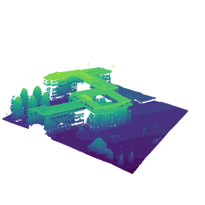

# unoglna_3dmodel
Make a 3D model of the UNOG Library &amp; Archives building

## Aims
This project aims to experiment with 3D modelling of geography in R.

So far, a successful albeit simple model of the UNOG Library & Archives has been created using LIDAR data (see **LIDAR_unog3dmap.R**).

A less successful attempt using just the rayvista package has also been developed, however without building height data (see **rayvista_unog3dmap.R**).

I hope to eventually combine LIDAR and OpenStreetMap data in order to create a more aesthetically pleasing model.
